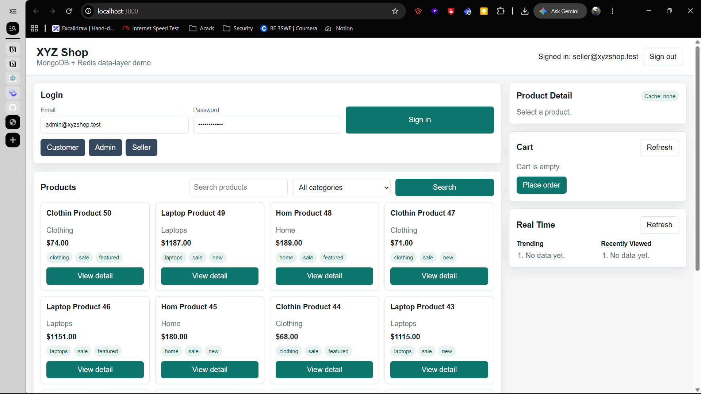
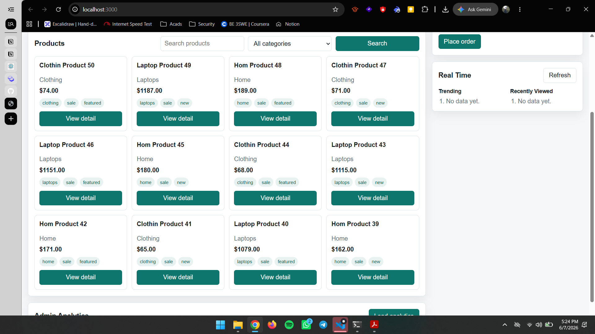
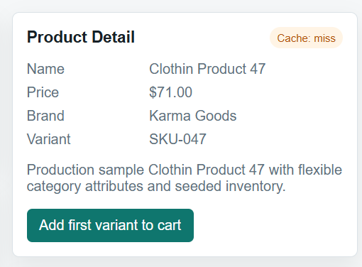
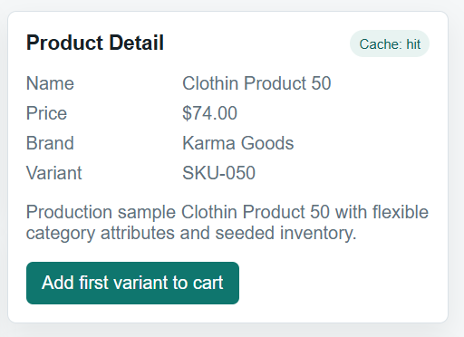
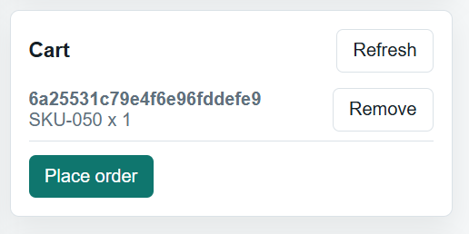
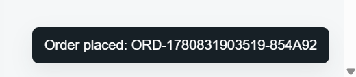
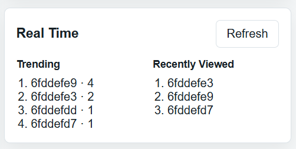
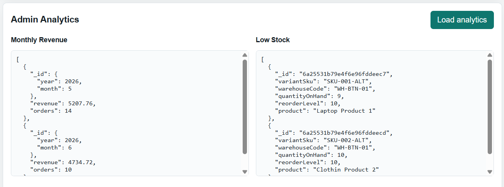

# XYZ Shop Data Layer

DBS302 assignment project for a production-ready e-commerce backend using MongoDB as the primary document database and Redis as the in-memory data layer. The project includes an Express API, MongoDB schemas and indexes, Redis caching and real-time features, Docker Compose infrastructure, seed data, a simple frontend demo, and a technical report.

## Project Purpose

XYZ Shop is an e-commerce platform migrating from a relational database to a polyglot persistence design. MongoDB stores durable business data such as users, products, inventory, orders, categories, and reviews. Redis supports hot-read performance and real-time workflows such as product caching, carts, sessions, rate limits, recently viewed products, leaderboards, and unique visitor estimates.

The focus of this project is the data layer, not advanced UI design.

## Tech Stack

- Node.js 20
- Express.js
- MongoDB 7
- Mongoose
- Redis 7
- ioredis
- Docker Compose
- JWT authentication
- bcrypt password hashing
- Static HTML/CSS/JavaScript frontend

## Features Implemented

### User Management

- User registration
- User login
- JWT authentication
- Password hashing with bcrypt
- Role-based access control:
  - `customer`
  - `seller`
  - `administrator`
- Seeded users with profile fields, addresses, and payment preferences

### Product Catalogue

- Product listing
- Product detail view
- Product creation for sellers/admins
- Product update for sellers/admins
- Product archive/delete for admins
- Category-based filtering
- Text search on product name, description, and tags
- Pagination
- Flexible product attributes using MongoDB `Map`
- Embedded product variants

### Cart And Sessions

- Redis-backed cart
- Add cart item
- Remove cart item
- Clear cart
- Session storage with TTL
- Guest cart key pattern support
- Authenticated user cart support

### Order Processing

- Transactional order placement
- Multi-line order support
- MongoDB transaction for stock decrement and order creation
- Atomic inventory decrement using conditional update
- Order history per user
- Order lifecycle status field and status history

### Redis Real-Time Features

- Product detail cache with TTL
- Cache invalidation on product update/archive
- Trending products using Redis Sorted Set
- Recently viewed products using Redis List
- Login and checkout rate limiting using Redis counters
- Buyer and seller leaderboards using Redis Sorted Sets
- Unique visitor estimates using Redis HyperLogLog

### Analytics And Reporting

- Monthly revenue aggregation
- Product purchase analysis aggregation
- Low-stock report aggregation
- Redis INFO endpoint for observability demonstration

## Folder Structure

```text
.
├── docker/
│   ├── init-replica.sh
│   └── redis.conf
├── public/
│   ├── index.html
│   ├── styles.css
│   └── app.js
├── scripts/
│   ├── seed.js
│   └── smoke-test.js
├── src/
│   ├── config/
│   ├── middleware/
│   ├── models/
│   ├── routes/
│   ├── services/
│   ├── app.js
│   └── server.js
├── docker-compose.yml
├── package.json
├── README.md
└── report.md
```

## Environment Setup

Local `.env` file:

```bash
cp .env.example .env
```

For running Node.js directly on the host machine, use:

```env
MONGODB_URI=mongodb://localhost:27017,localhost:27018,localhost:27019/xyz_shop?replicaSet=rs0
REDIS_URL=redis://localhost:6379
```

For running the API inside Docker, `docker-compose.yml` overrides those values with Docker service names:

```env
MONGODB_URI=mongodb://mongo1:27017,mongo2:27017,mongo3:27017/xyz_shop?replicaSet=rs0
REDIS_URL=redis://redis:6379
```

## Running The Project

### Option 1: Run Databases In Docker And API Locally

MongoDB replica set and Redis:

```bash
docker compose up -d mongo1 mongo2 mongo3 mongo-init redis
```

Dependencies:

```bash
npm install
```

Database seed:

```bash
npm run seed
```

API and frontend:

```bash
npm run dev
```

Frontend URL:

```text
http://localhost:3000
```

### Option 2: Run Full Stack In Docker

```bash
docker compose up api
```

Frontend URL:

```text
http://localhost:3000
```

## Seed Data

The seed script creates:

- 10 users
- 3 categories
- 50 products
- 100 inventory records
- 20 orders

All seeded accounts use this password:

```text
Password123!
```

Seeded accounts:

```text
admin@xyzshop.test
seller@xyzshop.test
customer1@xyzshop.test
customer2@xyzshop.test
customer3@xyzshop.test
customer4@xyzshop.test
customer5@xyzshop.test
customer6@xyzshop.test
customer7@xyzshop.test
customer8@xyzshop.test
```

## Frontend Demo

The frontend is served by Express from the `public/` folder.

Available frontend actions:

- Login as customer, seller, or administrator
- Browse products
- Search products
- Filter by category
- View product detail
- See Redis cache status
- Add product to cart
- Remove product from cart
- Place order
- View trending products
- View recently viewed products
- Load admin analytics

## Screenshots

### Screenshot 1: Home Page And Login



### Screenshot 2: Product Listing



### Screenshot 3: Product Detail Cache Miss



### Screenshot 4: Product Detail Cache Hit



### Screenshot 5: Redis Cart



### Screenshot 6: Successful Order Placement



### Screenshot 7: Trending Products And Recently Viewed



### Screenshot 8: Admin Analytics



### Database Evidence Screenshots

MongoDB viewer:

```text
http://localhost:8081
```

Redis viewer:

```text
http://localhost:8082
```

Database evidence files:

```text
screenshots/mongo-collections.png
screenshots/redis-keys.png
```

Smoke test evidence file:

```text
screenshots/smoke-tests.png
```

## API Documentation

### Authentication

Register:

```http
POST /api/auth/register
Content-Type: application/json

{
  "name": "Demo User",
  "email": "demo@example.com",
  "password": "Password123!"
}
```

Login:

```http
POST /api/auth/login
Content-Type: application/json

{
  "email": "customer1@xyzshop.test",
  "password": "Password123!"
}
```

### Products

List products:

```http
GET /api/products?page=1&limit=20
```

Search products:

```http
GET /api/products?q=laptop
```

Filter by category:

```http
GET /api/products?category=laptops
```

View product detail:

```http
GET /api/products/:id
```

Create product:

```http
POST /api/products
Authorization: Bearer <seller-or-admin-token>
Content-Type: application/json
```

Update product:

```http
PATCH /api/products/:id
Authorization: Bearer <seller-or-admin-token>
Content-Type: application/json
```

Archive product:

```http
DELETE /api/products/:id
Authorization: Bearer <admin-token>
```

Trending products:

```http
GET /api/products/trending
```

Recently viewed:

```http
GET /api/products/recently-viewed
Authorization: Bearer <token>
```

### Categories

List categories:

```http
GET /api/categories
```

Create category:

```http
POST /api/categories
Authorization: Bearer <admin-token>
```

Update category:

```http
PATCH /api/categories/:id
Authorization: Bearer <admin-token>
```

Delete category:

```http
DELETE /api/categories/:id
Authorization: Bearer <admin-token>
```

### Profile And Wishlist

View profile:

```http
GET /api/users/me
Authorization: Bearer <token>
```

Update profile:

```http
PATCH /api/users/me
Authorization: Bearer <token>
```

Manage wishlist:

```http
GET /api/users/me/wishlist
PUT /api/users/me/wishlist/:productId
DELETE /api/users/me/wishlist/:productId
Authorization: Bearer <token>
```

### Reviews

List product reviews:

```http
GET /api/products/:productId/reviews
```

Create product review:

```http
POST /api/products/:productId/reviews
Authorization: Bearer <token>
```

Update or delete review:

```http
PATCH /api/reviews/:id
DELETE /api/reviews/:id
Authorization: Bearer <review-owner-or-admin-token>
```

### Cart

Get cart:

```http
GET /api/cart
Authorization: Bearer <token>
```

Add or update item:

```http
PUT /api/cart/items/:productId
Authorization: Bearer <token>
Content-Type: application/json

{
  "variantSku": "SKU-001",
  "quantity": 1
}
```

Remove item:

```http
DELETE /api/cart/items/:productId
Authorization: Bearer <token>
```

Clear cart:

```http
DELETE /api/cart
Authorization: Bearer <token>
```

### Orders

Place order:

```http
POST /api/orders
Authorization: Bearer <token>
Content-Type: application/json

{
  "shippingAddress": {
    "label": "Home",
    "line1": "123 Market Street",
    "city": "Thimphu",
    "country": "Bhutan",
    "postalCode": "11001"
  }
}
```

Get order history:

```http
GET /api/orders
Authorization: Bearer <token>
```

Update order status:

```http
PATCH /api/orders/:id/status
Authorization: Bearer <token>
Content-Type: application/json

{
  "status": "confirmed",
  "note": "Payment verified"
}
```

### Analytics

Admin token required.

```http
GET /api/analytics/monthly-revenue
GET /api/analytics/product-purchases
GET /api/analytics/low-stock
GET /api/analytics/unique-visitors/:date
GET /api/analytics/redis-info
```

## MongoDB Design

MongoDB collections:

- `users`
- `categories`
- `products`
- `inventories`
- `orders`
- `reviews`

### Embedding And Referencing Decisions

User addresses and payment preferences are embedded because they are bounded and commonly loaded with the user profile.

Product variants are embedded because variants are tightly coupled to product display and checkout selection.

Product category and seller are referenced because categories and sellers have independent lifecycles.

Inventory is stored separately from products because stock changes frequently and must be updated transactionally without rewriting product documents.

Order line items embed snapshots of product name and price because orders must preserve historical purchase facts even if product details change later.

Reviews are separate documents because review count can grow without bound and moderation can happen independently.

### MongoDB Indexes

Implemented indexes include:

- Unique user email index
- User roles index
- Category parent/name index
- Unique category slug index
- Unique product slug index
- Product compound index `{ category: 1, status: 1, basePrice: 1 }`
- Product seller/date index `{ seller: 1, createdAt: -1 }`
- Product text index on `name`, `description`, and `tags`
- Unique inventory index `{ product: 1, variantSku: 1, warehouseCode: 1 }`
- Low-stock helper index `{ quantityOnHand: 1, reorderLevel: 1 }`
- Unique order number index
- Order history index `{ user: 1, createdAt: -1 }`
- Order status/date index `{ status: 1, createdAt: -1 }`
- Review product/user unique index

### MongoDB Aggregations

Aggregation pipelines are implemented in `src/services/analytics.service.js`.

- `monthlyRevenue()`
- `productPurchaseAnalysis()`
- `lowStock()`

### MongoDB Transactions

Order placement is implemented in `src/services/order.service.js`.

The transaction:

1. Reads selected products and variants.
2. Decrements inventory only if enough stock exists.
3. Creates the order document.
4. Commits or rolls back as one atomic workflow.

Redis cart clearing and leaderboard updates happen after the MongoDB transaction commits.

## Redis Design

Redis key patterns:

```text
cache:product:{id}
session:{id}
cart:{ownerType}:{ownerId}
recently_viewed:{userId}
leaderboard:trending_products
leaderboard:top_sellers
leaderboard:top_buyers
rate:{name}:{principal}
hll:unique_visitors:{yyyy-mm-dd}
lock:product:{id}
```

Redis data types used:

- String for product cache, sessions, and rate counters
- Hash for carts
- List for recently viewed products
- Sorted Set for trending products and leaderboards
- HyperLogLog for unique visitor estimates

Redis persistence is configured in `docker/redis.conf`:

- AOF enabled
- `appendfsync everysec`
- RDB snapshots enabled
- `maxmemory-policy allkeys-lru`

## Caching Strategy

The project uses cache-aside for product detail pages.

Flow:

1. Check Redis key `cache:product:{id}`.
2. If found, return cached product and set `X-Cache: hit`.
3. If missing, load from MongoDB.
4. Store result in Redis with TTL and jitter.
5. Return product and set `X-Cache: miss`.

Invalidation:

- Product update deletes the product cache key.
- Product archive/delete deletes the product cache key.

Stampede protection:

- A short Redis lock key `lock:product:{id}` is used during cache population.

## High Availability And Scalability

MongoDB replica set:

- `mongo1`
- `mongo2`
- `mongo3`

The local Docker setup initializes a 3-node replica set named `rs0`.

Redis:

- Local Docker setup runs one Redis node for development.
- Production recommendation is Redis Sentinel for failover or Redis Cluster for partitioning.

Sharding plan:

- `products`: candidate shard key `{ category: 1, _id: "hashed" }` for category browsing with distribution.
- `orders`: candidate shard key `{ user: "hashed" }` for user order history distribution.
- `inventories`: candidate shard key `{ product: "hashed" }` for distributed stock documents.

## Security Notes

Implemented:

- Password hashing with bcrypt
- JWT authentication
- Role-based access control
- Helmet HTTP security middleware
- Redis password support in Docker Compose
- `.env` ignored from Git

Production recommendations:

- Enable MongoDB authentication
- Use least-privilege MongoDB users
- Enable TLS for MongoDB and Redis
- Use Redis ACLs for per-application permissions
- Store secrets in a secure secret manager
- Avoid logging passwords, tokens, or payment details

## Observability Notes

Implemented:

- HTTP request logging with `morgan`
- Redis INFO endpoint for admin demonstration
- Error middleware with consistent JSON responses

Recommended for production:

- MongoDB slow query logs
- MongoDB profiler for selected thresholds
- Redis keyspace hit/miss monitoring
- API latency dashboards
- Transaction failure dashboards
- Cache-hit ratio reporting

## Validation

File smoke test:

```bash
npm run test:smoke
```

API smoke test:

```bash
npm run test:api
```

Smoke test screenshot evidence:

```bash
npm run test:smoke
npm run test:api
```

JavaScript syntax check:

```bash
powershell -Command "Get-ChildItem src,scripts,public -Recurse -Filter *.js | ForEach-Object { node --check $_.FullName }"
```

Docker Compose validation:

```bash
docker compose config
```

## Demo video:

```text
https://drive.google.com/drive/folders/1AVTWx4b29AFKXWRLB8Q9Z_kH22AYdd0_?usp=sharing
```


## Known Gaps

These items are documented or partially implemented but can be improved further:

- Redis Sentinel/Cluster is documented but not implemented in Docker Compose.
- MongoDB authentication and TLS are recommended but not enabled in local Docker.
- Screenshots have been captured under `screenshots/`.
- Real measured cache-hit ratio should be recorded after running the demo.
- Category CRUD routes, review routes, and profile update routes can be expanded if more completeness is required.

## References

- MongoDB Documentation: https://www.mongodb.com/docs/
- Redis Documentation: https://redis.io/docs/latest/
- Mongoose Documentation: https://mongoosejs.com/docs/
- Express Documentation: https://expressjs.com/
- Kristina Chodorow, MongoDB: The Definitive Guide
- Josiah L. Carlson, Redis in Action
- Pramod J. Sadalage and Martin Fowler, NoSQL Distilled
