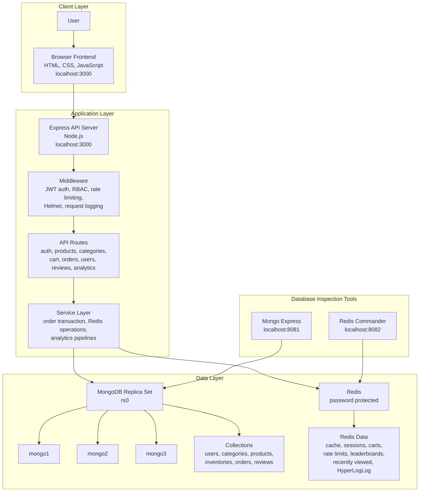

# System Architecture

Diagram files:

- Excalidraw: [diagrams/system-architecture.excalidraw](diagrams/system-architecture.excalidraw)
- PlantUML: [diagrams/system-architecture.puml](diagrams/system-architecture.puml)

## Explanation

The architecture is split into four clear parts: client layer, application layer, data layer, and database inspection tools.

The client layer is the browser-based frontend. It sends all requests to the Express API. It does not connect directly to MongoDB or Redis.

The application layer contains the Express backend. The backend is divided into routes, middleware, and services. Routes receive API requests, middleware handles authentication and security checks, and services contain the main business logic such as order placement, Redis caching, and analytics.

MongoDB stores the permanent data:

- users
- categories
- products
- inventories
- orders
- reviews

Redis stores fast temporary data and real-time data:

- product cache
- sessions
- carts
- rate limits
- trending products
- top sellers and buyers
- recently viewed products
- unique visitor estimates

Mongo Express is used to inspect MongoDB collections during the demo. Redis Commander is used to inspect Redis keys during the demo.

This design follows a layered client-server architecture with polyglot persistence. MongoDB is the main database, while Redis is used for speed and real-time features.
