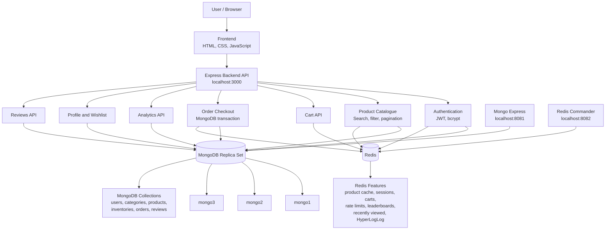

# System Architecture

## Explanation

The browser opens the frontend at `http://localhost:3000`. The frontend sends requests to the Express backend API.

MongoDB stores the permanent data:

- users
- categories
- products
- inventories
- orders
- reviews

Redis stores fast temporary data:

- product cache
- sessions
- carts
- rate limits
- trending products
- top sellers and buyers
- recently viewed products
- unique visitor estimates

Mongo Express is used to view MongoDB collections during the demo. Redis Commander is used to view Redis keys during the demo.
