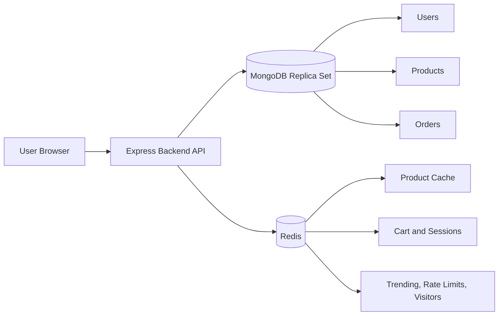

# XYZ Shop E-Commerce Backend Data Layer

## Title Page

Module: DBS302  
Assignment: Designing a Production-Ready E-Commerce Backend with MongoDB and Redis  
Project Name: XYZ Shop Data Layer  
Student Name: Sonam Tenzin  
Student Number: 0223030  
Student Work: Backend source code, README, technical report, screenshots, and demo

## Abstract

For this assignment, I built the backend data layer for a simple e-commerce system called XYZ Shop. The main database is MongoDB, and Redis is used for fast temporary data such as product cache, user sessions, carts, rate limits, recently viewed products, trending products, and unique visitor counting.

The aim of my project is to show how MongoDB and Redis can work together in an online shopping system. MongoDB stores the important long-term data, while Redis helps improve speed and supports real-time features.

## System Overview

The system has three main parts:

- A Node.js and Express backend API
- MongoDB for permanent e-commerce data
- Redis for fast access and real-time features

The frontend is a simple browser page served by the same Express app. It is used for demonstration purposes, such as login, product browsing, cart operations, order placement, and admin analytics.

## System Architecture Diagram



In this design, MongoDB is the main database. If Redis data is lost, the most important business data is still safe in MongoDB.

## Technology Used

I used the following technologies:

- Node.js and Express for the backend API
- MongoDB for document storage
- Mongoose for MongoDB models
- Redis for caching and fast temporary data
- Docker Compose for running MongoDB and Redis locally
- JWT for login tokens
- bcrypt for password hashing
- HTML, CSS, and JavaScript for the frontend demo

## Why I Used MongoDB

I used MongoDB because e-commerce products do not all have the same structure. For example:

- A laptop may have RAM, storage, and processor details.
- A clothing item may have fabric, size, and color.
- A home product may have material and warranty details.

Using MongoDB makes this easier because product documents can store flexible attributes. At the same time, important fields like name, price, category, and variants are still clearly defined in the schema.

## Why I Used Redis

I used Redis because some parts of an e-commerce website need to be very fast. Product details may be opened many times, especially during sales or promotions. Carts and sessions also need quick reads and writes.

Redis is used for:

- Product detail cache
- User sessions
- Shopping carts
- Rate limits
- Trending products
- Recently viewed products
- Leaderboards
- Unique visitor counting

## MongoDB Collections

I created six main MongoDB collections.

### 1. users

The `users` collection stores customer, seller, and administrator accounts.

It includes:

- Name
- Email
- Password hash
- Roles
- Addresses
- Payment preferences
- Wishlist product references

I embedded addresses and payment preferences because they are normally loaded with the user profile. I used references for wishlist products because product data changes separately.

### 2. categories

The `categories` collection stores product categories and sub-categories.

It includes:

- Name
- Slug
- Parent category
- Attribute definitions

I used a parent reference so that categories can support sub-categories.

### 3. products

The `products` collection stores product catalogue data.

It includes:

- Seller reference
- Category reference
- Name
- Description
- Tags
- Brand
- Price
- Flexible attributes
- Variants
- Rating summary

I embedded product variants because variants are closely related to the product. For example, size and color options are usually shown together with the product details.

### 4. inventories

The `inventories` collection stores stock data.

It includes:

- Product reference
- Variant SKU
- Warehouse code
- Quantity on hand
- Reserved quantity
- Reorder level

I kept inventory separate from products because stock changes often. This also makes it safer to update stock during checkout.

### 5. orders

The `orders` collection stores customer orders.

It includes:

- Order number
- User reference
- Order lines
- Status
- Status history
- Subtotal, tax, and total
- Shipping address snapshot
- Payment status

I stored product name and price snapshots inside the order lines. This is important because an old order should still show the price paid at that time, even if the product price changes later.

### 6. reviews

The `reviews` collection stores product reviews.

It includes:

- Product reference
- User reference
- Rating
- Title
- Review body
- Status

I kept reviews separate from products because a product can have many reviews.

## MongoDB Indexes

Indexes help MongoDB find data faster. I added indexes for the main search and lookup operations.

Important indexes include:

- Unique user email index for login
- Unique product slug index
- Product category, status, and price index for filtering and sorting
- Product text index on name, description, and tags for search
- Order user and created date index for order history
- Inventory product, SKU, and warehouse index for stock updates
- Review product and user index to avoid duplicate reviews

These indexes are useful because users often search products, filter products, login by email, and view order history.

## MongoDB Aggregation Reports

I implemented aggregation reports for admin analytics.

### Monthly Revenue

This report groups orders by month and calculates:

- Total revenue
- Number of orders

### Product Purchase Analysis

This report checks which products were purchased the most. It helps compare product sales performance.

### Low Stock Report

This report finds inventory items where the quantity is at or below the reorder level. This helps sellers or admins know when stock needs to be refilled.

## Order Transaction

The most important workflow is placing an order. This must be handled carefully because the system should not create an order if there is not enough stock.

I used a MongoDB transaction for order placement.

The order process is:

1. Read the cart from Redis.
2. Check each product and variant in MongoDB.
3. Decrease stock only if enough quantity is available.
4. Create the order.
5. Commit the transaction.
6. After the transaction succeeds, clear the Redis cart.
7. Update Redis leaderboards.

This makes the order process safer because stock update and order creation happen together.

## Redis Data Usage

I used more than four Redis data types.

### Strings

Used for:

- Product cache
- Sessions
- Rate limit counters

Example keys:

```text
cache:product:{id}
session:{id}
rate:{name}:{principal}
```

### Hashes

Used for shopping carts.

Example key:

```text
cart:{ownerType}:{ownerId}
```

Each cart item is stored under the product ID.

### Lists

Used for recently viewed products.

Example key:

```text
recently_viewed:{userId}
```

The newest product is added to the front of the list, and the list is limited to the latest 10 products.

### Sorted Sets

Used for leaderboards and trending products.

Example keys:

```text
leaderboard:trending_products
leaderboard:top_sellers
leaderboard:top_buyers
```

Sorted sets are useful because Redis can quickly return the top products, sellers, or buyers.

### HyperLogLog

Used for estimating unique visitors.

Example key:

```text
hll:unique_visitors:{yyyy-mm-dd}
```

This is useful because it can estimate unique users without storing every visitor ID in full.

## Product Cache Strategy

I used a cache-aside approach for product details.

The flow is:

1. The API checks Redis first.
2. If the product is found in Redis, the API returns it quickly.
3. If it is not found, the API loads it from MongoDB.
4. The API stores the product in Redis with an expiry time.
5. When the product is updated or archived, the cache is deleted.

The frontend shows the cache result using:

```text
Cache: miss
Cache: hit
```

This helps demonstrate that Redis is being used.

## Cache Stampede Protection

A cache stampede can happen when many users request the same product at the same time and the cache is empty. To reduce this problem, I added a short Redis lock key when loading a product from MongoDB.

This means only one request should refill the cache at a time.

## Performance Testing Plan

The project shows cache behaviour through the `X-Cache` response header.

During testing:

| Request | Expected Result |
| --- | --- |
| First product detail request | `X-Cache: miss` |
| Second product detail request for the same product | `X-Cache: hit` |

The cache-hit ratio can be calculated as:

```text
cache hits / total product detail requests
```

For example, if 8 out of 10 product detail requests are served from Redis, the cache-hit ratio is:

```text
8 / 10 = 80%
```

## MongoDB Replica Set

I configured MongoDB with three Docker containers:

- `mongo1`
- `mongo2`
- `mongo3`

These containers are started as a replica set named `rs0`.

A replica set is useful because if one database node fails, another node can still keep the database available.

## Sharding Plan

For a larger production system, I would shard the main collections.

My suggested shard keys are:

| Collection | Suggested Shard Key | Reason |
| --- | --- | --- |
| products | `{ category: 1, _id: "hashed" }` | Supports category browsing and spreads products across shards |
| orders | `{ user: "hashed" }` | Spreads user orders evenly |
| inventories | `{ product: "hashed" }` | Spreads stock records by product |

I would avoid using only `createdAt` as a shard key because new records would all go to the same area of the database.

## Redis Persistence And Eviction

Redis is configured with:

- AOF enabled
- `appendfsync everysec`
- RDB snapshots
- `allkeys-lru` eviction policy

This means Redis saves data regularly, but MongoDB is still the main permanent database. If Redis loses some temporary data, the core order and product data is still stored in MongoDB.

## High Availability

For MongoDB, I used a three-node replica set in Docker.

For Redis, the local project uses one Redis container. In a real production system, I would use Redis Sentinel or Redis Cluster:

- Redis Sentinel is useful for failover.
- Redis Cluster is useful when the Redis data needs to be split across multiple servers.

## Consistency And CAP Discussion

For checkout, I chose stronger consistency. This means the system should avoid selling stock that does not exist. If the database cannot safely update stock and create the order, the checkout should fail.

For product browsing, I allowed faster reads through Redis. This means users may briefly see slightly older product data, but the data will refresh after cache expiry or cache deletion.

In simple terms:

- Checkout should be correct first.
- Product browsing should be fast.

## Security

Implemented security features:

- Passwords are hashed with bcrypt.
- Login uses JWT tokens.
- Seller and admin routes are protected by roles.
- Helmet is used for basic HTTP security headers.
- Redis is configured with password support in Docker Compose.
- `.env` is ignored by Git.

Recommended production improvements:

- Enable MongoDB username and password authentication.
- Use Redis ACLs for more detailed Redis permissions.
- Use TLS for database connections.
- Store secrets in a secure secret manager.
- Avoid logging passwords, tokens, or payment details.

## Observability

Implemented:

- HTTP request logs using `morgan`
- Redis INFO endpoint for admin demonstration
- Error responses in JSON format

Recommended production monitoring:

- MongoDB slow query logs
- MongoDB replication lag monitoring
- Redis memory and cache-hit monitoring
- API response time monitoring
- Failed checkout monitoring

## Frontend Demonstration

I created a simple frontend for the demo. It supports:

- Login
- Product browsing
- Product detail view
- Cache miss and cache hit display
- Cart operations
- Order placement
- Trending products
- Recently viewed products
- Admin analytics

The frontend is available at:

```text
http://localhost:3000
```

## Screenshots

Screenshots are included in the `screenshots/` folder:

- `01-home-login.png`
- `02-product-listing.png`
- `03-cache-miss.png`
- `04-cache-hit.png`
- `05-cart.png`
- `06-order-placement.png`
- `07-realtime-features.png`
- `08-admin-analytics.png`

Extra database evidence screenshots are also included:

- `mongo-collections.png`, showing the six MongoDB collections
- `redis-keys.png`, showing Redis keys for cache, sessions, rate limits, leaderboards, recently viewed products, and unique visitors
- `smoke-tests.png`, showing the file smoke test and API smoke test passing

## Demonstration Steps

Demo video:

```text
https://drive.google.com/drive/folders/1AVTWx4b29AFKXWRLB8Q9Z_kH22AYdd0_?usp=sharing
```

For my demonstration, I use the following flow:

1. Start Docker Desktop.
2. Run the MongoDB and Redis containers.
3. Seed the database.
4. Start the API and frontend.
5. Login as a customer.
6. Browse products.
7. Open one product twice to show cache miss and cache hit.
8. Add a product to the cart.
9. Place an order.
10. Show trending and recently viewed products.
11. Login as admin.
12. Show monthly revenue and low-stock analytics.

## Limitations

The project covers the main data-layer requirements, but there are still areas that could be improved:

- Redis Sentinel or Redis Cluster is explained but not fully implemented in Docker.
- MongoDB authentication and TLS are recommended but not enabled in the local Docker setup.
- Redis password authentication is enabled, but Redis ACLs and TLS can be improved further for production.
- A larger benchmark could be added for cache-hit ratio and response time.

## Conclusion

This project demonstrates how MongoDB and Redis can be used together for an e-commerce backend. MongoDB stores the main business data, such as products, users, inventory, and orders. Redis improves speed and supports real-time features like carts, sessions, trending products, rate limits, and unique visitor counts.

The most important part of the project is the order workflow, where MongoDB transactions are used to reduce the risk of incorrect stock updates. Overall, this project shows a practical data-layer design for an e-commerce system.

## References

- MongoDB Documentation: https://www.mongodb.com/docs/
- Redis Documentation: https://redis.io/docs/latest/
- Mongoose Documentation: https://mongoosejs.com/docs/
- Express Documentation: https://expressjs.com/
- Kristina Chodorow, MongoDB: The Definitive Guide
- Josiah L. Carlson, Redis in Action
- Pramod J. Sadalage and Martin Fowler, NoSQL Distilled
