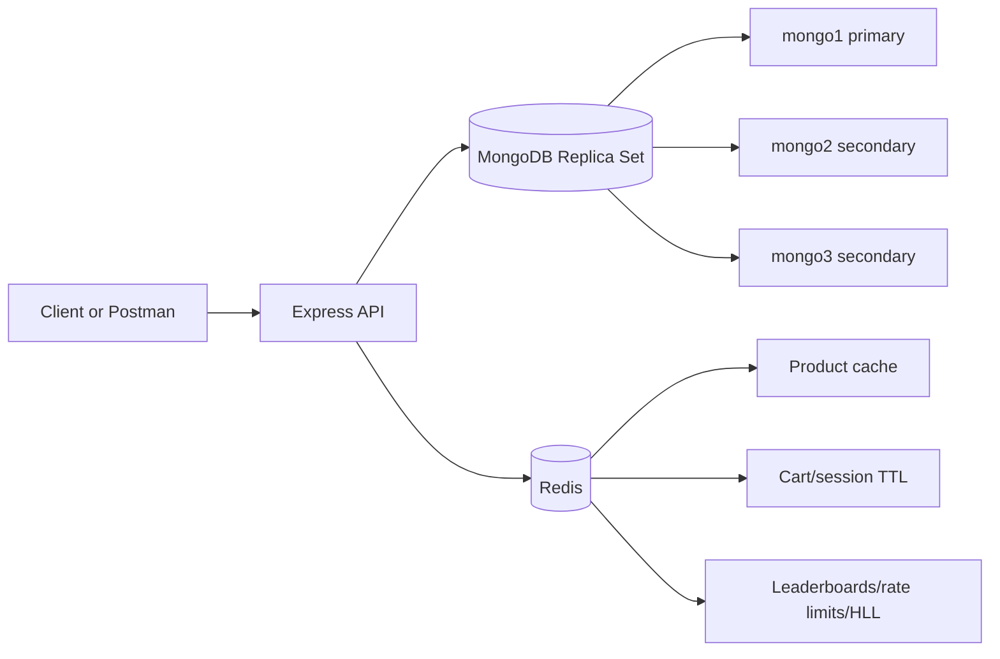

# XYZ Shop: Production-Ready E-Commerce Data Layer

## Title Page

Module: DBS302  
Assignment: Designing a Production-Ready E-Commerce Backend with MongoDB and Redis  
Project: XYZ Shop Data Layer  
Deliverables: Source code, technical report, and demonstration

## Abstract

XYZ Shop uses MongoDB as the source-of-truth document database and Redis as an in-memory acceleration and real-time feature layer. MongoDB stores users, products, categories, inventory, orders, and reviews with indexes, aggregations, transactions, and a replica-set deployment. Redis serves hot product reads, sessions, carts, rate limits, recently viewed lists, sorted-set leaderboards, and HyperLogLog unique visitor estimates.

## System Architecture

MongoDB is the durable system of record. Redis is deliberately treated as disposable acceleration except where persistence improves operational recovery for sessions and real-time counters.

## Technology Justification

MongoDB fits the product catalogue because categories have different attribute shapes: laptops need RAM and storage, clothing needs fabric and size, and home goods need material or warranty data. Mongoose schemas keep core fields validated while `Product.attributes` remains flexible.

Redis fits the high-throughput and real-time requirements because product detail cache reads, cart mutations, session TTLs, counters, lists, sorted sets, and HyperLogLog operations are low-latency atomic operations.

## MongoDB Data Model

### users

Stores authentication identity, roles, addresses, payment preferences, and wishlist references. Addresses and payment preferences are embedded because they are usually read with the user profile and bounded in size. Wishlist uses product references because product data changes independently.

### categories

Stores category hierarchy and attribute definitions. Parent category is referenced to support arbitrary tree depth without duplicating category documents.

### products

Stores seller reference, category reference, product details, flexible attributes, and embedded variants. Variants are embedded because they are small, tightly coupled to product display, and needed in product detail reads. Seller and category are referenced because they have independent lifecycles.

### inventories

Stores stock per product, variant, and warehouse. Inventory is separate from product because stock changes frequently and must be updated transactionally during checkout without rewriting the full product document.

### orders

Stores order header, user reference, embedded line item snapshots, totals, shipping address snapshot, and lifecycle history. Line items embed product name and price snapshots because orders must preserve the purchase facts even if a product changes later.

### reviews

Stores product and user references with rating and body. Reviews are separate because they can grow without bound and can be moderated independently.

## Indexing Strategy

Implemented indexes include:

- `users.email` unique index for login and duplicate prevention.
- `products.slug` unique index for stable catalogue lookup.
- `products { category, status, basePrice }` compound index for category browsing and price sorting.
- `products { name, description, tags }` text index for full-text search.
- `orders { user, createdAt }` for order history.
- `inventories { product, variantSku, warehouseCode }` unique index for stock updates.

These indexes support the primary read and write paths without indexing every field. Additional indexes should be added from measured slow-query logs, not speculation.

## Aggregation Pipelines

`monthlyRevenue()` groups valid orders by year and month, returning revenue and order count for reporting.

`productPurchaseAnalysis()` unwinds order lines, groups purchased units and revenue by product, joins product names, sorts by demand, and returns the top products.

`lowStock()` compares `quantityOnHand` against `reorderLevel` and joins product names for alerting.

## Transactional Workflow

Order placement uses a MongoDB session and `withTransaction()`:

1. Load each active product and selected variant.
2. Atomically decrement inventory using `findOneAndUpdate()` with `quantityOnHand >= requested quantity`.
3. Create the order document with line-item snapshots and totals.
4. After commit, clear the Redis cart and update buyer/seller leaderboards.

The stock decrement and order creation are atomic. Redis updates happen after commit because Redis is not the source of truth.

## Redis Data Types

Strings:

- `cache:product:{id}` stores JSON product detail with TTL.
- `session:{id}` stores session data with TTL.
- `rate:{name}:{principal}` stores request counters with expiry.

Hashes:

- `cart:{ownerType}:{ownerId}` stores product IDs as fields and cart items as JSON values.

Lists:

- `recently_viewed:{userId}` stores the last 10 product IDs viewed by a user.

Sorted Sets:

- `leaderboard:trending_products` increments product views.
- `leaderboard:top_sellers` increments seller activity.
- `leaderboard:top_buyers` increments buyer spend.

HyperLogLog:

- `hll:unique_visitors:{yyyy-mm-dd}` estimates daily unique visitors.

## Cache Strategy and Coherence

Product detail uses cache-aside:

1. API checks Redis.
2. On miss, API loads MongoDB.
3. API writes Redis with TTL plus small jitter.
4. Product updates and archive operations delete the product cache key.

This strategy keeps MongoDB authoritative and makes stale reads bounded by TTL. Cache invalidation is explicit for product mutations. Stampede protection uses a short Redis lock key so only one worker should populate the cache during a miss window.

## Performance Plan

Hot paths served by Redis:

- Product detail cache.
- Cart hash reads and writes.
- Session lookup.
- Login and checkout rate limits.
- Trending leaderboard.

Cache-hit ratio should be measured from `X-Cache` headers or API logs: `hits / (hits + misses)`. For a flash sale, expected behavior is first request miss and repeated product-detail requests hit Redis until TTL expiry or invalidation.

## Scalability and Sharding

Replica set is configured locally with three MongoDB nodes. For sharding:

- `products`: shard by hashed `_id` or hashed `seller` for write distribution. If category browsing dominates, a compound shard key such as `{ category: 1, _id: "hashed" }` can keep category access targeted while avoiding a single hot category chunk.
- `orders`: shard by `{ user: "hashed" }` for user order-history distribution. For time-series reporting at very large scale, copy order events into an analytics store or shard analytical collections by month.
- `inventories`: shard by hashed `product` to distribute high-volume stock documents.

Shard keys avoid monotonically increasing values such as `createdAt` alone because those can create hot chunks during writes.

## High Availability

MongoDB runs as a 3-node replica set. Writes should use majority write concern for checkout-critical data. Reads for critical workflows should use primary or majority read concern. Non-critical catalogue reads may use secondary reads if latency and freshness trade-offs are acceptable.

Redis HA is documented as Sentinel or Cluster in production. Sentinel is appropriate for a single primary with replicas and failover. Cluster is better once memory or throughput requires partitioning keys across nodes.

## Consistency and CAP Trade-Offs

Checkout favors consistency over availability. If the MongoDB primary cannot commit the inventory decrement and order creation transaction, the order should fail rather than oversell stock.

Catalogue browsing favors availability and latency. Redis may serve slightly stale product detail within TTL bounds. Product updates invalidate cache keys to reduce stale windows.

Leaderboards and unique visitor estimates are eventually consistent analytical features. They do not block checkout or user identity operations.

## Durability

MongoDB is durable through replica-set replication and journaling. Redis uses AOF `everysec` plus RDB snapshots. This hybrid gives acceptable recovery for sessions and counters while preserving Redis performance. Losing the final second of Redis writes is acceptable because MongoDB remains authoritative for orders and inventory.

## Security

Passwords are hashed with bcrypt. Authentication uses signed JWTs. Role checks protect seller and administrator endpoints. Production deployment should also enable MongoDB authentication, Redis ACLs, TLS between services, secret management through a vault or platform secret store, least-privilege database users, and request logging without sensitive payloads.

## Observability

Application logs use `morgan` and structured error responses. MongoDB production settings should enable profiler or slow-query logging for queries above a chosen threshold. Redis observability is exposed through `GET /api/analytics/redis-info` for demonstration and should be integrated with Prometheus, Grafana, or cloud metrics in production.

Important metrics:

- MongoDB operation latency, transaction aborts, lock percentage, replication lag.
- Redis memory usage, evictions, keyspace hits/misses, connected clients, rejected connections.
- API checkout latency, cache-hit ratio, rate-limit rejections, order failure causes.

## Demonstration Script

1. Start MongoDB replica set and Redis.
2. Run `npm run seed`.
3. Login as `customer1@xyzshop.test`.
4. Fetch product list and choose a product ID.
5. Fetch product detail twice and show `X-Cache` changing from `miss` to `hit`.
6. Add item to cart.
7. Place order and show inventory is decremented transactionally.
8. Show trending products and administrator analytics.
9. Show Redis INFO and unique visitor estimate.

## Citations

- MongoDB Manual: https://www.mongodb.com/docs/
- Redis Documentation: https://redis.io/docs/latest/
- Mongoose Documentation: https://mongoosejs.com/docs/
- Express Documentation: https://expressjs.com/
- Chodorow, K. MongoDB: The Definitive Guide.
- Carlson, J. Redis in Action.
- Sadalage, P. J. and Fowler, M. NoSQL Distilled.
